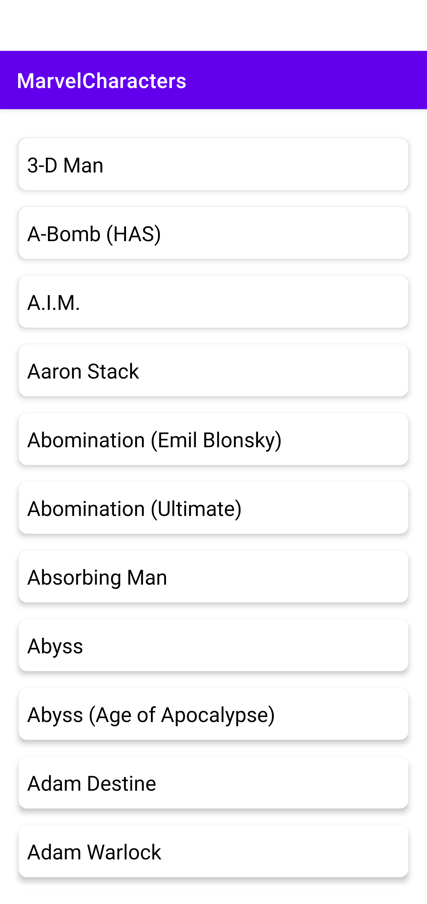
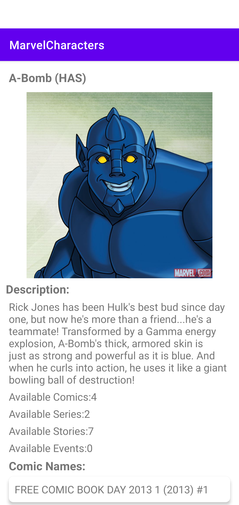

# Marvel Characters
The app uses Marvel character apis to list all the characters from Marvel series. On click of any character user will be redirected to the details screen.

#### Architecture:
 * MVVM clean with multi module architecture.

#### Development Language:
* Kotlin

#### Test framework:
* Junit
* Mokito

#### Libraries:
* Retrofit
* Hilt
* Glide

#### Screenshots:
##### Character List Screen

##### Character Details Screen

